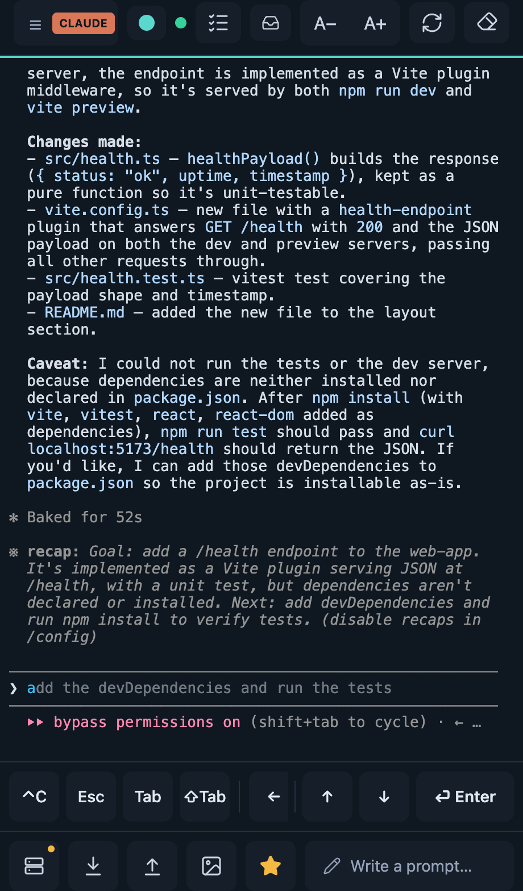

# cc-screen

[](https://github.com/dibbla-agents/cc-screen-rust/releases/latest)
[](https://github.com/dibbla-agents/cc-screen-rust/actions/workflows/hub-ci.yml)
[](https://github.com/dibbla-agents/cc-screen-rust/actions/workflows/windows-ci.yml)
[](LICENSE)

**Drive Claude Code, Codex, Gemini, and Kimi sessions on all your machines —
from your phone.** cc-screen keeps your AI coding agents running 24/7 as
long-lived terminal sessions on your own computers, and lets you check in,
type, approve, paste images, and browse/edit files from anywhere: a phone
browser (installable PWA), any desktop browser, or a native terminal client.
Sessions survive disconnects and reboots — a restart resumes each agent's
conversation right where it left off.

<p align="center">
  
  &nbsp;&nbsp;
  
</p>

Website: **<https://ccscreen.dev>** · Docs: **<https://ccscreen.dev/docs/>**

## Get started (hosted)

The hosted hub is the fastest path — **free during beta**:

1. **Sign up** at **<https://app.ccscreen.dev>** (email or Google).
2. **Connect a machine** — run the one-liner on any computer where your coding
   agents should live, then approve the short code it prints from your
   dashboard:

   ```sh
   # macOS / Linux
   curl -fsSL https://app.ccscreen.dev/install.sh | sh -s -- <machine-name> --assistants
   ```

   ```powershell
   # Windows
   irm "https://app.ccscreen.dev/install.ps1?name=<machine-name>&assistants=all" | iex
   ```

3. **Open <https://app.ccscreen.dev> on your phone** (Add to Home Screen for
   the app experience) — your machine is online, start a session.

The `--assistants` flag also offers to install any missing coding CLIs
(claude / codex / gemini / kimi) into `~/.local/bin` — no sudo. Your code and
terminals stay on **your** machines; the hub is a relay that owns no PTY and no
filesystem, and each machine dials *out* to it (no inbound ports).

## Self-host

Everything the hosted hub runs is in this repo — run your own hub and point
your machines at it. Both binaries ship as prebuilt artifacts (macOS
arm64/x86_64, Linux arm64/x86_64 static musl, Windows x86_64) served straight
from the latest GitHub Release.

**① The hub — your front door** (its own binary + service, default port 8840):

```sh
curl --proto '=https' --tlsv1.2 -LsSf \
  https://github.com/dibbla-agents/cc-screen-rust/releases/latest/download/cc-screen-hub-installer.sh | sh
cc-screen-hub install --password PW --agents 'laptop:T1,server:T2'
```

**② The machines** — on each computer where your coding agents live:

```sh
curl --proto '=https' --tlsv1.2 -LsSf \
  https://github.com/dibbla-agents/cc-screen-rust/releases/latest/download/cc-screen-rust-installer.sh | sh
cc-screen-rust install --hub https://hub:8840 --hub-token T1 --machine-id laptop --hub-only
```

**③ The clients** — the web app is served by the hub (open it in a browser and
Add to Home Screen); `ccs` is the native terminal client:

```sh
curl --proto '=https' --tlsv1.2 -LsSf \
  https://github.com/dibbla-agents/cc-screen-rust/releases/latest/download/cc-screen-tui-installer.sh | sh
ccs --server https://hub:8840 --token <client-token>
```

One machine? Run the hub and the agent on the same box. A single agent can also
serve directly with no hub (`http://machine:8839`). Every binary self-updates:
`cc-screen-rust update` / `cc-screen-hub update` / `ccs update`.

See **[HUB.md](HUB.md)** for the full guide: per-agent uplink tokens, the
security model (the agents run YOLO — keep them tailnet-only), auth/passwords,
and TLS for off-tailnet access.

**Run your own multi-tenant hub.** The shipped hub binary and Docker image are
built with the `multi-tenant` feature — dormant by default. Set
`CCHUB_DATABASE_URL` (e.g. `sqlite:///path/hub.db`) and the same hub becomes a
multi-account service: public signup, Google sign-in, per-user machine
enrollment via `<hub>/activate`, per-plan caps (`cc-screen-hub user plan
<email> free|pro|unlimited` — no billing; plans are set by hand). See
[`docker/hub/README.md`](docker/hub/README.md) and `cc-screen-hub --help`.

**Docker:** CI publishes both images to GHCR on every release tag —
`ghcr.io/dibbla-agents/cc-screen-hub` (the front door) and
`ghcr.io/dibbla-agents/cc-screen-agent` (a containerized machine host). The
compose files in [`docker/hub/`](docker/hub/README.md) and
[`docker/agent/`](docker/agent/README.md) reference those tags.

## Build from source

```sh
./build.sh build          # frontend -> embed -> ./target/release/cc-screen-rust
./build.sh run            # build + run in the foreground
CCWEB_ADDR=127.0.0.1:8839 ./target/release/cc-screen-rust
```

Requires the Rust toolchain (`rustup`) and Node (for the Vite build — the React
PWA is embedded into the binaries at compile time, so `frontend/dist` must be
built first; `build.sh` handles the ordering). `./install.sh` builds and
installs the local service, delegating the service step to `cc-screen-rust
install` so the unit/plist has a single source of truth. Tests:
`cargo test --workspace`.

**Cutting a release:** bump with `./bump.sh X.Y.Z`, commit, then `./release.sh`
tags and the CI cross-build publishes the GitHub Release — the install
one-liners serve straight from `releases/latest`.

## Repository layout

| Path | What |
|------|------|
| `src/` | the **agent**: axum router, the PTY session engine, HTTP+WS handlers, files/upload/clip, the embedded frontend |
| `crates/hub/` | **`cc-screen-hub`** — the aggregator: registry + auth gate + byte relay; multi-tenant SaaS mode behind `CCHUB_DATABASE_URL` |
| `crates/protocol/` | shared HTTP+WS wire types + the agent↔hub envelope — the single source of truth for the contract |
| `crates/auth/`, `crates/push/` | shared auth (signed cookies/tokens) + Web Push |
| `crates/tui/` | **`ccs`** — the native terminal client (ratatui, session switcher + multi-pane grid) |
| `frontend/` | the React PWA, embedded into both the agent and the hub |

## Contributing & design docs

Start with **[AGENTS.md](AGENTS.md)** (repo guide for humans and AI agents),
then **[PLAN.md](PLAN.md)** (server design + decisions), **[TUI_PLAN.md](TUI_PLAN.md)**
(the `ccs` client), and **[HUB.md](HUB.md)** (the aggregator). Licensed under
[MIT](LICENSE).
