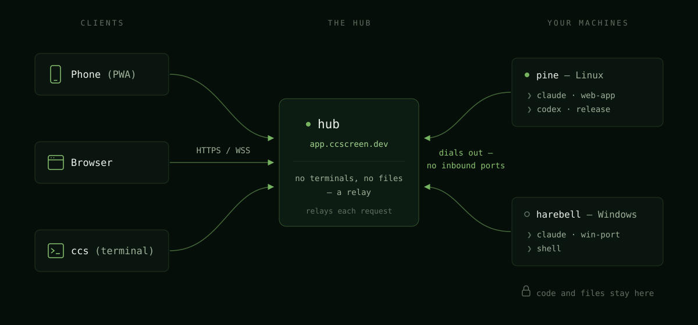
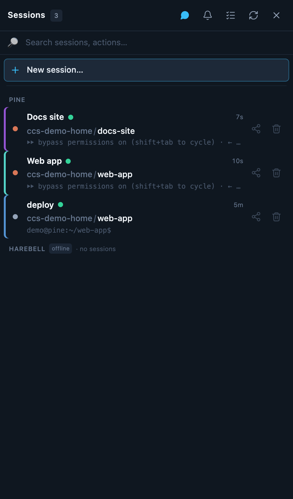

# What is cc-screen?

cc-screen keeps a team of AI coding **agents** — Claude Code, Codex, Gemini,
Kimi — working around the clock on your own computers, and lets you check in on
any of them from a phone, a browser, or a terminal.

Four words carry the whole model:

- **Machines** are your computers — a laptop, a home server, a cloud box.
  Each one runs a small background process (the cc-screen *agent*) that you
  install with one command.
- **Sessions** are real terminal sessions the agent owns on that machine. A
  session runs one coding CLI (`claude`, `codex`, `gemini`, `kimi`, or a plain
  shell) in a real PTY, so it keeps running whether or not you're watching.
- **Assistants** are the coding CLIs themselves. cc-screen doesn't replace
  them — it launches, supervises, and reconnects them.
- **The hub** at [app.ccscreen.dev](https://app.ccscreen.dev) is one address
  in front of all your machines. Each machine dials *out* to the hub and
  registers; you sign in once and see every machine's sessions in one list.

The hub owns **no terminals and no files** — it's a registry and a relay. Your
code, your sessions, and your CLI logins stay on your machines; the hub passes
bytes between your browser and the machine that owns them. (More in
[Security model](security/).)

## What it feels like

- Start a Claude Code session on your desktop from the bus, watch it work,
  and answer its questions from your phone.
- Keep four agents busy in a multi-pane grid on a laptop, each pane a live
  terminal on a different machine.
- Open the built-in file browser and editor to review what an agent just
  wrote — markdown preview included — without SSH.
- Get a push notification when an agent finishes its turn.

## Two ways in

- **The web app** — a PWA served by the hub. Works in any browser; add it to
  your phone's home screen for the app experience.
  See [Using the web app](web-app/).
- **`ccs`** — a native terminal client with a session switcher and a
  multi-pane grid, for when you live in a terminal anyway. Sign it in with
  `ccs activate` — the same code-approve gesture as enrolling a machine.
  See [The ccs terminal client](tui/).

## Where to go next

- **[Quickstart](quickstart/)** — signup to your first live session in about
  five minutes.
- **[Self-hosting](self-hosting/)** — everything the hosted hub does, you can
  run yourself. Fully supported.
